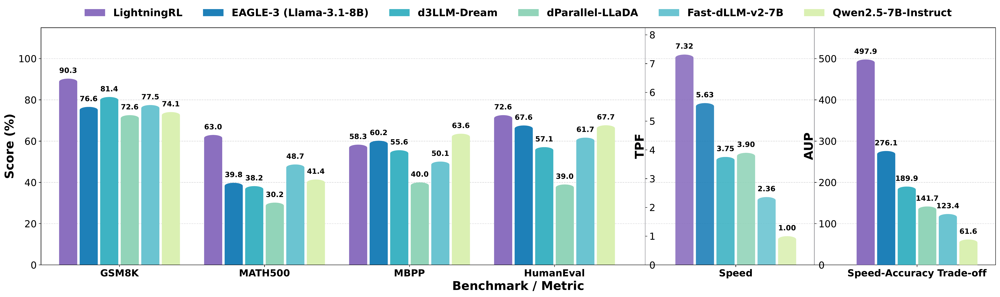
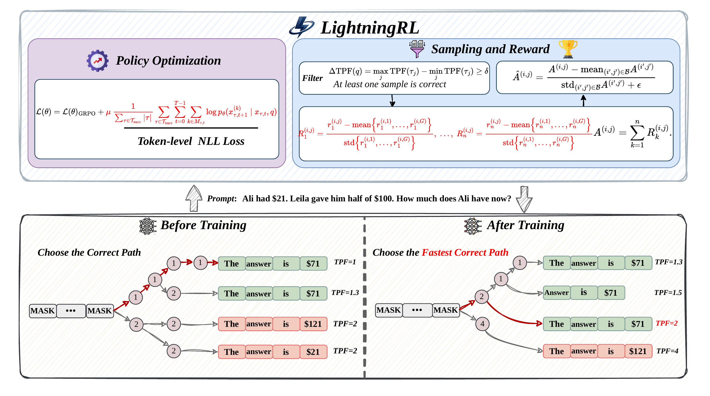
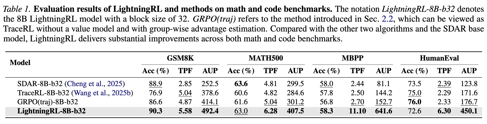
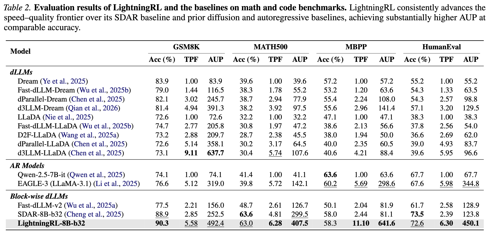
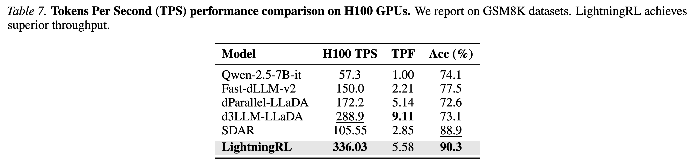

<div align="center">

<p align="center">
  
</p>

<h3>Breaking the Accuracy–Parallelism Trade-off of Block-wise dLLMs via Reinforcement Learning</h3>

<p>
<b>Yanzhe Hu</b><sup>1,2</sup>, <b>Yijie Jin</b><sup>1</sup>, <b>Pengfei Liu</b><sup>1</sup>, <b>Kai Yu</b><sup>1</sup>, <b>Zhijie Deng</b><sup>1,†</sup>
</p>

<p>
<sup>1</sup>Shanghai Jiao Tong University    <sup>2</sup>Huazhong University of Science and Technology
</p>

<p>
<sup>†</sup>Corresponding author
</p>

</div>

<p align="center">
  <a href="https://sjtu-deng-lab.github.io/LightningRL">
    
  </a>
  <a href="#">
    
  </a>
  <a href="https://sjtu-deng-lab.github.io/LightningRL/paper/LightningRL.pdf">
    
  </a>
  <a href="https://github.com/SJTU-DENG-Lab/LightningRL">
    
  </a>
  <a href="https://huggingface.co/collections/SJTU-DENG-Lab/lightingrl-series">
    
  </a>
</p>

<p align="center">
  
</p>

---

## TL;DR

We propose **LightningRL**, a reinforcement learning framework that breaks the accuracy–parallelism trade-off of block-wise diffusion Large Language Models (dLLMs). LightningRL optimizes both speed and generation quality simultaneously through three key modifications to GRPO: **per-reward decoupled normalization**, **token-level NLL regularization**, and **TPF-aware filtering**. Applied to SDAR-8B, LightningRL achieves an average TPF of **7.32** and AUP of **497.9**, significantly outperforming EAGLE-3, Fast-dLLM-v2, and other leading baselines across math and code benchmarks.

## Highlights

- **Breaking the Trade-off**: LightningRL achieves **7.32** average TPF and **497.9** AUP, simultaneously improving both speed and accuracy of block-wise dLLMs
- **Three Key Innovations**: Per-reward decoupled normalization, token-level NLL loss, and TPF-aware filtering work synergistically to stabilize multi-objective RL training
- **Strong Generalization**: Consistent improvements across math (GSM8K, MATH500) and code (MBPP, HumanEval) benchmarks
- **Practical Speed**: **336.03** TPS on H100 GPUs, 3.2x faster than the SDAR baseline (deployed using SGLang)

## Method

We advocate a post-training approach for pre-trained block-wise dLLMs that directly optimizes the speed–quality frontier. Our core insight is that we do not require the model to decode aggressively along all sampling trajectories, but rather to find several highly parallelizable ones that can yield correct results. We formulate this as a reinforcement learning problem using the GRPO framework with three key modifications:

<p align="center">
  
</p>

- **Per-Reward Decoupled Normalization**: Independently normalizes each reward component within the group to prevent signal collapse when combining accuracy and speed rewards of different scales
- **Token-Level NLL Regularization**: Applies dense token-factorized supervision on correct trajectories to anchor the policy toward correctness and prevent drift into fast-but-incorrect modes
- **TPF-Aware Filtering**: Dynamically selects prompts whose sampled trajectories exhibit diverse levels of parallelism, maintaining meaningful learning signals and improving sample efficiency

## Performance

### LightningRL vs RL Methods

Compared with existing RL approaches for dLLMs (TraceRL, GRPO), LightningRL delivers substantial improvements across both math and code benchmarks, achieving the best Acc, TPF, and AUP simultaneously.

<p align="center">
  
</p>

### Full Comparison with Baselines

LightningRL consistently advances the Pareto frontier against all categories of baselines — vanilla dLLMs (Dream, LLaDA), AR models (Qwen, EAGLE-3), and block-wise dLLMs (Fast-dLLM-v2, SDAR).

<p align="center">
  
</p>

### Wall-Clock Speed (H100 GPUs)

LightningRL achieves **336.03** TPS on a single H100 GPU, **3.2x** faster than the SDAR baseline and significantly outperforming all other methods while maintaining the highest accuracy (**90.3%**).

<p align="center">
  
</p>

## Quick Start

### Installation

```bash
git clone https://github.com/SJTU-DENG-Lab/LightningRL.git
cd LightningRL

uv sync
source .venv/bin/activate
```

### RL Training

LightningRL post-training on SDAR-8B-b32:

```bash
scripts/train_rl.sh
```

### Evaluation

```bash
scripts/eval.sh
```

## ⚙️ Data

You can navigate to `./data` to download datasets for evaluation and training:

```bash
cd data
python download_data.py --dataset MATH500
python download_data.py --dataset MATH_train
cd ..
```

After downloading the data, select (or create) a config file in `./configs` to specify the dataset paths and training settings.

Or you can simply download all the data needed using the following command:

```bash
scripts/download_data.sh
```

### Configuration Guide for `lightningrl.yaml`

To ensure a smooth training process, please pay close attention to the following configuration requirements in your `lightningrl.yaml` file:

#### 1. Experiment Project Name
The `project` field within the `experiment` block must match the filename of your configuration file:

```yaml
experiment:
    project: "lightningrl"  # Should match the config filename (e.g., lightningrl.yaml)
```

#### 2. Model Paths
The `model` block requires absolute paths for model checkpoints to ensure proper loading:

*   **`pretrained_model`**: Must be set to the **absolute path** of your pre-trained model.
*   **`value_base_model`**: This field is associated with `use_value_model` in the `training` block. If `use_value_model` is set to `True`, this field must be populated.
    *   *Note:* Currently, the value model does not actively participate in training; it is provided as an optional component to facilitate experimentation and reproducibility.

```yaml
model:
    pretrained_model: "/absolute/path/to/your/pretrained_model"
    value_base_model: "/absolute/path/to/your/value_base_model"
```

#### 3. Training Controls
Ensure your training flags are configured correctly:

```yaml
training:
    # Set to True if using a value model for exploration;
    # otherwise, keep as False to skip value model loading.
    use_value_model: False
```

## Acknowledgement

We would like to express our gratitude to the following works for providing important foundations and inspiration:

[SDAR](https://github.com/JetAstra/SDAR), [dLLM-RL](https://github.com/Gen-Verse/dLLM-RL), [Block Diffusion](https://arxiv.org/abs/2503.09573), [DiRL](https://github.com/OpenMOSS/DiRL), [LMDeploy](https://github.com/InternLM/lmdeploy).

## Contact

For any issues or inquiries, please feel free to open an issue in this repository. For further questions, you can contact us via email:

- **Yanzhe Hu**: yanzhehu@hust.edu.cn
- Yijie Jin: drewjin0827@gmail.com

## Citation

If you find our work helpful, please consider citing:

```bibtex
@inproceedings{hu2026lightningrl,
  title={LightningRL: Breaking the Accuracy--Parallelism Trade-off of Block-wise dLLMs via Reinforcement Learning},
  author={Hu, Yanzhe and Jin, Yijie and Liu, Pengfei and Yu, Kai and Deng, Zhijie},
  booktitle={Proceedings of the International Conference on Machine Learning (ICML)},
  year={2026}
}
```
